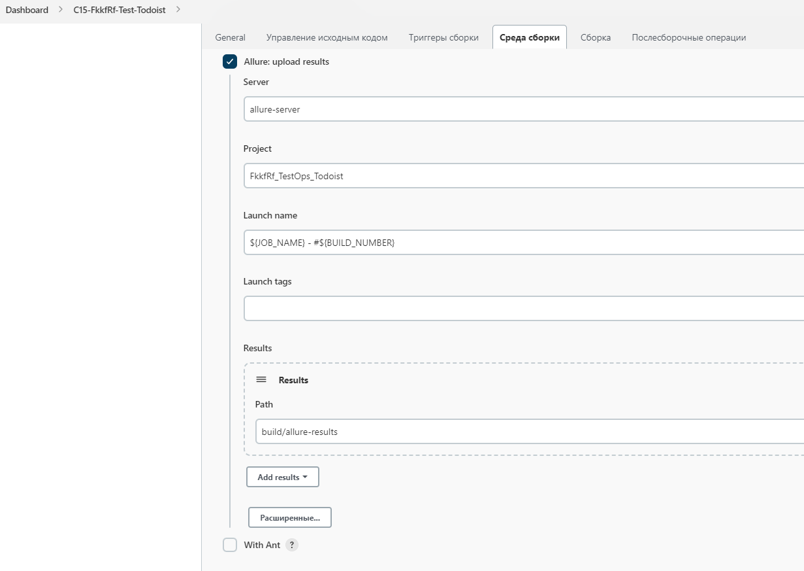
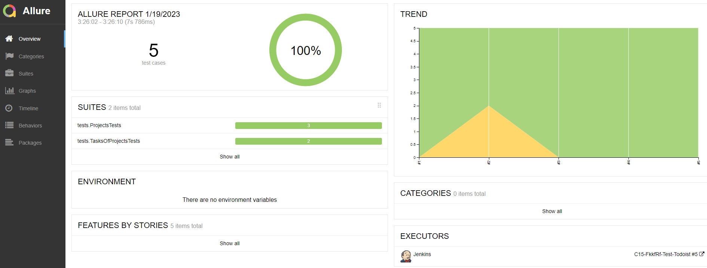
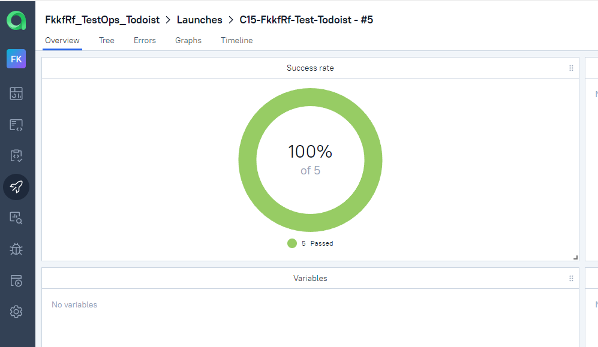
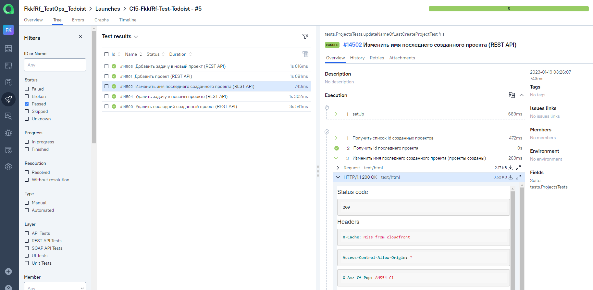
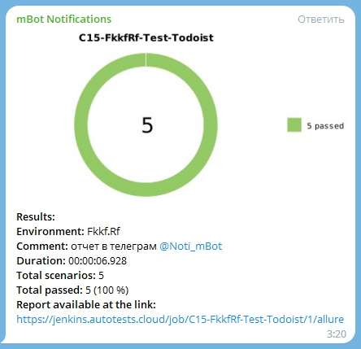

# Проект по автоматизации тестирования сайта Todoist


<code></code>
#### © Doist Inc.

# :closed_book:    Содержание

> - [Технологии и инструменты](#toolbox-технологии-и-инструменты)
>
> - [Реализованы проверки](#chart-реализованы-проверки)
>
> - [Запуск тестов из терминала](#triangular_flag_on_post-запуск-тестов-из-терминала)
>
> - [Запуск тестов в Jenkins](#triangular_flag_on_post-запуск-тестов-в-jenkins)
>
> - [Отчет о результатах тестирования в Allure Report](#triangular_flag_on_post-отчет-о-результатах-тестирования-в-allure-report)
>
> - [Интеграция с Allure TestOps](#triangular_flag_on_post-интеграция-с-allure-testops)
>
> - [Уведомления в Telegram с использованием бота](#triangular_flag_on_post-уведомления-в-telegram-с-использованием-бота)
>
> - [Пример запуска теста в Selenoid](#triangular_flag_on_post-пример-запуска-теста-в-selenoid)

## :toolbox: Технологии и инструменты

<p  align="center"

<code></code>
<code></code>
<code></code>
<code></code>
<code></code>
<code></code>
<code></code>
<code></code>
<code></code>
<code></code>
<code></code>
</p>

> - *В данном проекте использовались:*
>- *<code><strong>*Java*</strong></code> с использованием фреймворка <code><strong>*Selenide*</strong></code> -
   автотесты для UI*
>- *<code><strong>*Gradle*</strong></code> - сборка проекта*
>- *<code><strong>*JUnit 5*</strong></code> - фреймворк для модульного тестирования*
>- *<code><strong>*Jenkins*</strong></code> - запуск тестов*
>- *<code><strong>*Selenoid*</strong></code> - запуска браузеров в контейнерах <code><strong>*Docker*</strong></code>.*
>- *<code><strong>*Allure Report*</strong></code> - визуализации результатов тестирования*
>- *<code><strong>*Allure TestOps*</strong></code> - управление тестами*
>- *<code><strong>*Jira, Telegram Bot*</strong></code> - уведомление о результатах тестирования*

## :chart_with_upwards_trend: Реализованы проверки

### UI

#### ✓ Тест 1

> - [x] *Открыть сайт __https://nexign.com/ru__*
>- [x] *Проверить элементы панели элементов на главной станице сайта:*
>  - [x] *1.Проверка переключения языка*
>  - [x] *2.Проверка перехода в клиентский портал*
>  - [x] *3.Проверка поиска по сайту*

#### ✓ Тест 2

> - [x] *Открыть сайт __https://nexign.com/ru__*
>- [x] *На главной странице зайти в меню 'Контакты'*
>- [x] *Проверить отображение списка региональных контактов при клике на переключатель  'Показать региональные контакты'*

#### ✓ Тест 3

> - [x] *Открыть карьерный сайт __https://job.nexign.com/__*
>- [x] *На главной странице проверить все пункты главного меню*
>  - [x] *При клике на каждый элемент меню должна открыться страница с соответствующим заголовком*

#### ✓ Тест 4

> - [x] *Открыть карьерный сайт __https://job.nexign.com/__*
>- [x] *На главной странице зайти в меню 'Вакансии'*
   >  - [x] *1. Установить регион  поиска вакансии*
 >  - [x] *2. Проверить название города в карточке вакансии*

## :triangular_flag_on_post: Запуск тестов из терминала

Чтобы запуск тестов легче конфигурирровать, без внесения правок в код, использовалась библиотека owner

В этом случае параметры запуска выносятся в файлы *properties*

> **Property**   файл расположен в директории   **src/test/resources/config/**
> 
#### ✓ Локальный запуск тестов

```bash
gradle test -Denv=local  
```
#### ✓ Удаленный запуск тестов

```bash
gradle test -Denv=remote 
```

> где **remote**   определяет **property**  файл, в котором указаны параметры для запуска теста:

> **baseUrl** – адрес удаленного сервера, на котором будут запускаться тесты.
>
> **browser** – браузер, в котором будут выполняться тесты
>
> **browserVersion** – версия браузера, в которой будут выполняться тесты
>
> **browserSize** – размер окна браузера, в котором будут выполняться тесты


## :triangular_flag_on_post: Запуск тестов в Jenkins

 [Сборка в Jenkins](https://jenkins.autotests.cloud/job/C15-FkkfRf-Test-Nexign/)

Для обеспечения мобильности выбора параметров при запуске теста из Jenkins,

в настройках сборки задаём варианты параметров для запуска:

<p align="center">
  
</p>

В этом лучае скрипт запуска из Jenkins будет следующим:

> clean
>
> test
>
> -D**browse**r=${BROWSER}
>
> -D**browserVersion**=${BROWSER_VER}
>
> -D**browserSize**=${BROWSER_SIZE}
>
> -D**remote**=${REMOTE_URL}

Затем выбираем "Собрать с параметрами" и указываем необходимые

<p align="center">
  
</p>


Затем выбираем "Собрать с параметрами" и указываем необходимые

<p align="center">
  
</p>


### Основная страница проекта в Jenkins

<p align="center">
  
</p>

После выполнения сборки, в блоке <code><strong>*История сборок*</strong></code> напротив номера сборки появится
значок <code><strong>*Allure
Report*</strong></code>, кликнув по которому, откроется страница с сформированным html-отчетом.

## :triangular_flag_on_post: Отчет о результатах тестирования в Allure Report

 [Allure Report](https://jenkins.autotests.cloud/job/C15-FkkfRf-Test-Nexign/allure/) 

#### ✓ Главная страница Allure-отчета содержит следующие информационные блоки:

> <code>*ALLURE REPORT*</code> - отображает дату и время прохождения теста, общее количество прогнанных кейсов, а также
> диаграмму с указанием процента и количества успешных, упавших и сломавшихся в процессе выполнения тестов

> <code>*TREND*</code> - отображает тренд прохождения тестов от сборки к сборке

> <code>*SUITES*</code> - отображает распределение результатов тестов по тестовым наборам

> <code>*ENVIRONMENT*</code> - отображает тестовое окружение, на котором запускались тесты (в данном случае информация
> не задана)

> <code>*CATEGORIES*</code> - отображает распределение неуспешно прошедших тестов по видам дефектов

> <code>*FEATURES BY STORIES*</code> - отображает распределение тестов по функционалу, который они проверяют

> <code>*EXECUTORS*</code> - отображает исполнителя текущей сборки (ссылка на сборку в Jenkins)

<p align="center">
  
</p>

#### ✓ В разделе Behaviors тесты отображаются  сгруппироваными в многоуровневый список:

<p align="center">
  
</p>

## :triangular_flag_on_post: Интеграция с Allure TestOps

 [Allure TestOps](https://allure.autotests.cloud/launch/18153) 

#### ✓ Основной дашборд

<p align="center">
  
</p>

#### ✓ Тест-кейсы

<p align="center">
  
</p>

## :triangular_flag_on_post: Уведомления в Telegram с использованием бота

 После завершения сборки специальный бот, созданный в <code>Telegram</code>, автоматически обрабатывает и отправляет
 сообщение с отчетом о прогоне тестов.

<p align="left">

</p>
<p align="center">

</p>

## :triangular_flag_on_post: Пример запуска теста в Selenoid

 К каждому тесту в отчете прилагается видео, cформированное в процессе выполнения тестов на платформе Selenoid.
> <p align="left">

  </p>
<p align="center">
  
</p>

