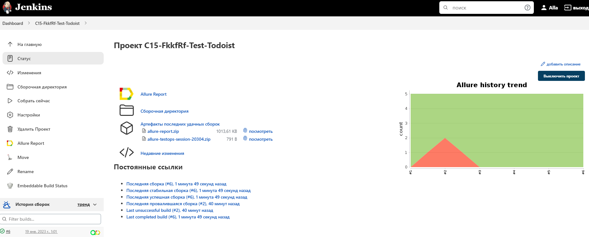
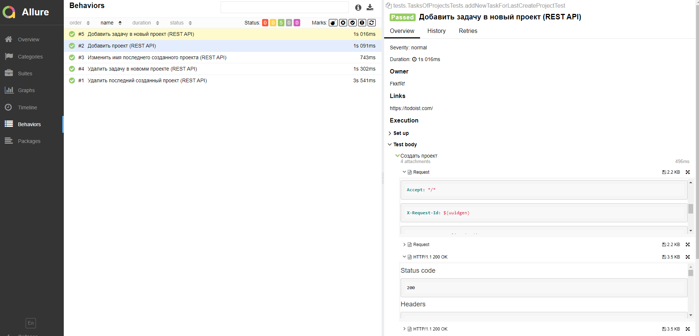

# Проект по автоматизации тестирования сайта Todoist

<code></code>
#### © Doist Inc.

# :closed_book:    Содержание

> - [Технологии и инструменты](#toolbox-технологии-и-инструменты)
>
> - [Реализованы проверки](#chart_with_upwards_trend-реализованы-проверки)
>
> - [Запуск тестов в Jenkins](#triangular_flag_on_post-запуск-тестов-в-jenkins)
>
> - [Отчет о результатах тестирования в Allure Report](#triangular_flag_on_post-отчет-о-результатах-тестирования-в-allure-report)
>
> - [Интеграция с Allure TestOps](#triangular_flag_on_post-интеграция-с-allure-testops)
>
> - [Уведомления в Telegram с использованием бота](#triangular_flag_on_post-уведомления-в-telegram-с-использованием-бота)
>

## :toolbox: Технологии и инструменты

</code>
<code></code>
<code></code>
<code></code>
<code></code>
<code></code>
<code></code>
<code></code>
<code></code>
<code></code>
<code></code>

> - *В данном проекте использовались:*
>- *<code><strong>*Java*</strong></code> с использованием фреймворка <code><strong>*Selenide*</strong></code> -
   автотесты для UI*
>- *<code><strong>*Gradle*</strong></code> - сборка проекта*
>- *<code><strong>*JUnit 5*</strong></code> - фреймворк для модульного тестирования*
>- *<code><strong>*Jenkins*</strong></code> - запуск тестов*
>- *<code><strong>*RestAssured*</strong></code> - Java-библиотека для тестирования REST API.*
>- *<code><strong>*Allure Report*</strong></code> - визуализации результатов тестирования*
>- *<code><strong>*Allure TestOps*</strong></code> - управление тестами*
>- *<code><strong>*Telegram Bot*</strong></code> - уведомление о результатах тестирования*

## :chart_with_upwards_trend: Реализованы проверки

### API

#### ✓ Тесты

> - [x] *Добавить проект*
>- [x] *Изменить имя последнего созданного проекта*
>- [x] *Удалить последний созданный проект*
>- [x] *Добавить задачу в новый проект*
>- [x] *Удалить задачу в новом проекте*

## :triangular_flag_on_post: Запуск тестов в Jenkins

 [Сборка в Jenkins](https://jenkins.autotests.cloud/job/C15-FkkfRf-Test-Todoist/)

При настройке параметров запуска в Jenkins сразу же определяем интеграцию с проектом в TestOps:

  

**Cкрипт запуска** из Jenkins:

> clean
>
> test

### Основная страница проекта в Jenkins

  

После выполнения сборки, в блоке <code><strong>*История сборок*</strong></code> напротив номера сборки появится
значок <code><strong>*Allure
Report*</strong></code>, кликнув по которому, откроется страница с сформированным html-отчетом.

## :triangular_flag_on_post: Отчет о результатах тестирования в Allure Report

 [Allure Report](https://jenkins.autotests.cloud/job/C15-FkkfRf-Test-Todoist/allure/) 

#### ✓ Главная страница Allure-отчета содержит следующие информационные блоки:

> <code>*ALLURE REPORT*</code> - отображает дату и время прохождения теста, общее количество прогнанных кейсов, а также
> диаграмму с указанием процента и количества успешных, упавших и сломавшихся в процессе выполнения тестов

> <code>*TREND*</code> - отображает тренд прохождения тестов от сборки к сборке

> <code>*SUITES*</code> - отображает распределение результатов тестов по тестовым наборам

> <code>*ENVIRONMENT*</code> - отображает тестовое окружение, на котором запускались тесты (в данном случае информация
> не задана)

> <code>*CATEGORIES*</code> - отображает распределение неуспешно прошедших тестов по видам дефектов

> <code>*FEATURES BY STORIES*</code> - отображает распределение тестов по функционалу, который они проверяют

> <code>*EXECUTORS*</code> - отображает исполнителя текущей сборки (ссылка на сборку в Jenkins)

  

#### ✓ В разделе Behaviors тесты отображаются  сгруппироваными в многоуровневый список:

  

## :triangular_flag_on_post: Интеграция с Allure TestOps

 [Allure TestOps](https://allure.autotests.cloud/project/1827/launches) 

#### ✓ Lanches
Вся информация о результатах запуска тестов хранится в разделе **Launchs**.

  

#### ✓ Тест-кейсы

Тест-кейсы автоматически создаются на основе списка тестов, в AllureReport

  

## :triangular_flag_on_post: Уведомления в Telegram с использованием бота

После завершения сборки специальный бот, созданный в <code>Telegram</code>, автоматически обрабатывает и отправляет
сообщение с отчетом о прогоне тестов.

